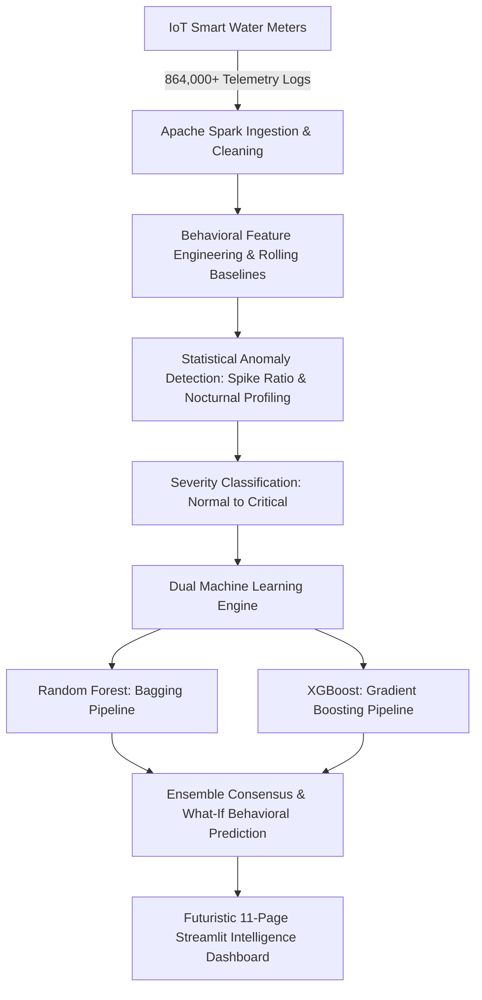

# 💧 Smart Water Leakage Analysis & Predictive Risk Intelligence
### *Big Data Analytics & Machine Learning Platform for Smart Water Grids*

[](https://www.python.org/)
[](https://streamlit.io/)
[](https://spark.apache.org/)
[](https://xgboost.readthedocs.io/)
[](#license)

A state-of-the-art smart city water monitoring and leakage analytics system. It processes large-scale IoT smart meter telemetry, identifies abnormal flow patterns and nocturnal seepages using dynamic statistical baselines, predicts pipeline failure risks using dual ensemble machine learning models (**Random Forest + XGBoost**), and delivers operational intelligence through an interactive, glassmorphic Streamlit command center.

---

## 🌟 Key Highlights & Modern UI Experience

- **Futuristic Command Center:** Designed with a soft lavender aesthetic, glassmorphic floating cards, and animated glowing accents.
- **Central 3D Holographic Globe:** Interactive wireframe Earth globe with concentric orbital radar rings visualizing city-wide pipe network surveillance.
- **Dynamic Telemetry & Signal Equalizer:** 16-bar flow equalizer, smooth diurnal spline trend curve, and circular donut network coverage indicator.
- **Amazon / Flipkart-Style Faceted Filter Sidebar:**
  - Segment data dynamically by **Risk Tier**, **Leak Severity Class**, **Smart Meter ID**, and **Time of Day (AM/PM)**.
  - Live record counters, instant active filter badges, and one-click filter reset.
- **Atmosphere & Theme Customization:** Switch seamlessly between *Soft Lavender Glow*, *Holographic Mesh*, *Hydro Core Drop*, and *Minimalist Studio*.
- **Full Interactivity:** Every sidebar filter instantly recalculates and re-renders metrics, charts, and tables across all 11 analytical pages in real time.

---

## 📋 System Architecture & Pipeline



---

## 📊 Dashboard Modules (11 Pages)

| # | Page | Key Visuals & Functionality |
|---|------|-----------------------------|
| 1 | **📊 System Overview** | Executive cockpit, 3D globe, 16-bar flow equalizer, spline consumption curve, circular donut, and diurnal threat cards. |
| 2 | **🔴 Leakage Severity Analysis** | 5-class breakdown (`Normal`, `Low Risk`, `Moderate`, `High Risk`, `Critical Leak`), temporal incident trajectory, and volume loss statistics. |
| 3 | **🏠 Household Risk Intelligence** | Residential risk ranking, top 10 high-risk meters leaderboard, and usage vs. spike scatter analysis. |
| 4 | **💧 Water Consumption Behavior** | 24-hour diurnal curves, morning/evening peak demand analysis, weekday vs. weekend profiles, and baseline distributions. |
| 5 | **⚠️ Abnormal Pattern Detection** | Mathematical spike ratio distribution ($S_t = U_t / B_t$), anomaly scatter matrices, and nocturnal leakage flags (12 AM – 5 AM). |
| 6 | **🔬 Household Explorer** | Deep-dive forensic tool for individual meters with high-resolution time series and anomalous incident markers. |
| 7 | **🤖 ML Risk Prediction** | Dual-model risk classification simulator, feature importance rankings, and interactive behavioral what-if sliders. |
| 8 | **📈 Model Comparison (RF vs XGB)** | Head-to-head performance benchmarks (Accuracy, Precision, Recall, F1, Latency), ROC curves, and confusion matrices. |
| 9 | **🧠 Smart Insights Panel** | Automated heuristic intelligence, priority maintenance dispatch queue, and actionable utility recommendations. |
| 10 | **🗃️ Data Explorer** | Paginated raw telemetry table with column filters, sortable attributes, and direct 1-click CSV export. |
| 11 | **📖 Methodology & Formulas** | Complete mathematical reference for spike ratios, moving average baselines, Z-score thresholds, and ML architectures. |

---

## 🔬 Mathematical Formulations

### 1. Dynamic Spike Ratio
$$\text{Spike Ratio } (S_t) = \frac{\text{Actual Usage } (U_t)}{\text{Dynamic Baseline } (B_t)}$$
*where $B_t$ is computed using a rolling historical window for each specific household.*

### 2. Statistical Moving Average Baseline
$$B_t = \frac{1}{k}\sum_{i=1}^{k} U_{t-i}$$

### 3. Z-Score Anomaly Deviation
$$Z_t = \frac{U_t - \mu_{\text{baseline}}}{\sigma_{\text{baseline}}}$$

---

## 🤖 Dual-Model Machine Learning Engine

| Attribute | Random Forest Classifier | XGBoost Classifier |
|-----------|-------------------------|--------------------|
| **Architecture** | Ensemble Bagging (Bootstrap Aggregation) | Extreme Gradient Boosting |
| **Number of Estimators** | 100 Decision Trees | 150 Gradient-Boosted Trees |
| **Primary Strength** | High stability, low variance, robust against outliers | Superior sensitivity/recall on non-linear anomaly boundaries |
| **Ensemble Logic** | Consensus agreement yields high-confidence alerts; divergence triggers manual review |

### Key Behavioral Features Engineered:
- `avg_usage`, `max_usage`, `std_usage` — Fundamental flow statistics
- `night_avg_usage` — Mean flow between 12:00 AM – 5:00 AM (primary leak marker)
- `avg_spike_ratio`, `max_spike_ratio` — Transient pressure burst indicators
- `night_day_ratio` — Ratio of night-to-day consumption
- `cv_usage` — Coefficient of variation (consumption volatility)

---

## 📁 Repository Structure

```
Smart-Water-Leakage-Analysis/
├── .streamlit/
│   └── config.toml                  # Streamlit theme & UI layout configuration
├── dashboard/
│   ├── assets/                      # UI background themes & visual elements
│   │   ├── bg_option1_globe.jpg     # Soft globe & radar backdrop
│   │   ├── bg_option2_city_grid.jpg # Holographic urban water grid
│   │   └── bg_option3_water_drop.jpg# Hydro core drop aesthetic
│   ├── dashboard.py                 # Core 11-page Streamlit application
│   └── requirements.txt             # Dashboard-specific dependencies
├── data/
│   ├── raw/                         # Raw smart meter ingestion files
│   └── processed/                   # Spark-processed datasets (parquet)
│       └── leakage_intelligence_dataset.parquet (864K optimized records)
├── models/
│   ├── household_risk_model.pkl     # Trained Random Forest pipeline
│   ├── household_xgboost_model.pkl  # Trained XGBoost pipeline
│   └── model_comparison_metrics.pkl # Serialized evaluation metrics
├── notebooks/
│   └── 05_machine_learning_prediction.ipynb # Interactive training & EDA
├── train_xgboost_model.py           # End-to-end model training script
├── requirements.txt                 # Global project dependencies
└── README.md                        # Documentation
```

---

## 🚀 Quickstart Guide

### 1. Clone the Repository
```bash
git clone https://github.com/Rahulkadam1221/Smart-Water-Leakage-Analysis.git
cd Smart-Water-Leakage-Analysis
```

### 2. Set Up Virtual Environment
```bash
# Windows
python -m venv venv
venv\Scripts\activate

# macOS / Linux
python3 -m venv venv
source venv/bin/activate
```

### 3. Install Dependencies
```bash
pip install -r requirements.txt
```

### 4. (Optional) Retrain Machine Learning Models
```bash
python train_xgboost_model.py
```

### 5. Launch the Dashboard
```bash
streamlit run dashboard/dashboard.py
```
*The command center will automatically open in your browser at `http://localhost:8501`.*

---

## 🛠️ Tech Stack

- **Language:** Python 3.11+
- **Big Data Engine:** Apache Spark (PySpark)
- **Machine Learning:** scikit-learn, XGBoost, Joblib
- **Data Engineering:** Pandas, NumPy, PyArrow
- **Visualization:** Plotly Express & Graph Objects, Seaborn, Matplotlib
- **Web Interface:** Streamlit (Custom Glassmorphic CSS & Vanilla HTML5 Canvas components)

---

## 📜 License & Citation

This project is licensed under the MIT License for academic, research, and smart city infrastructure development.
